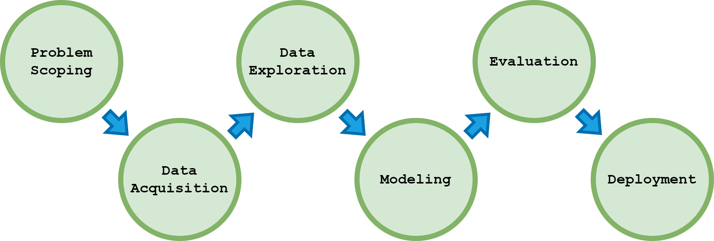

# Loan Approval Prediction
Project Loan Approval Prediction

- Topic : Machine Learning
- Programming languages : Python
- Packages : pandas, numpy, sklearn, seaborn, matplotlib
- Algorithms used : Decision Tree, Random Forest, K-Nearest Neighbor, Logistic Regression, Gaussian Naive Bayes

# Data Source
The dataset used in this project comes from the Loan Predication dataset from Kaggle. Here is the [link](https://www.kaggle.com/ninzaami/loan-predication/home)

# AI Project Cycle
